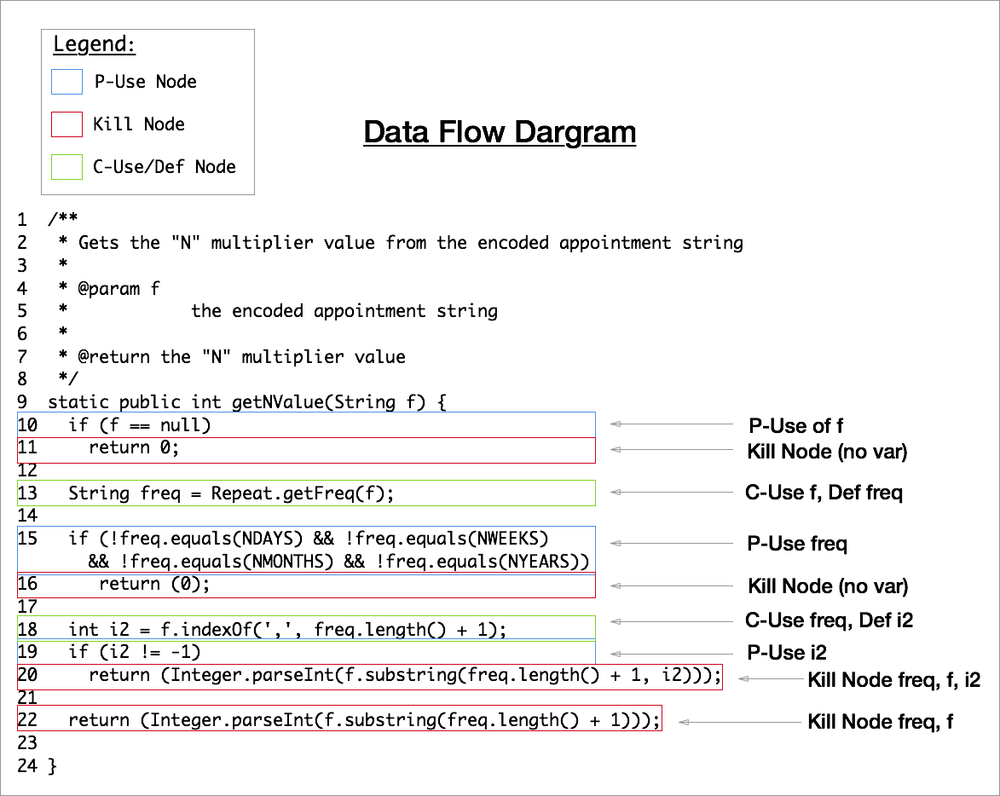
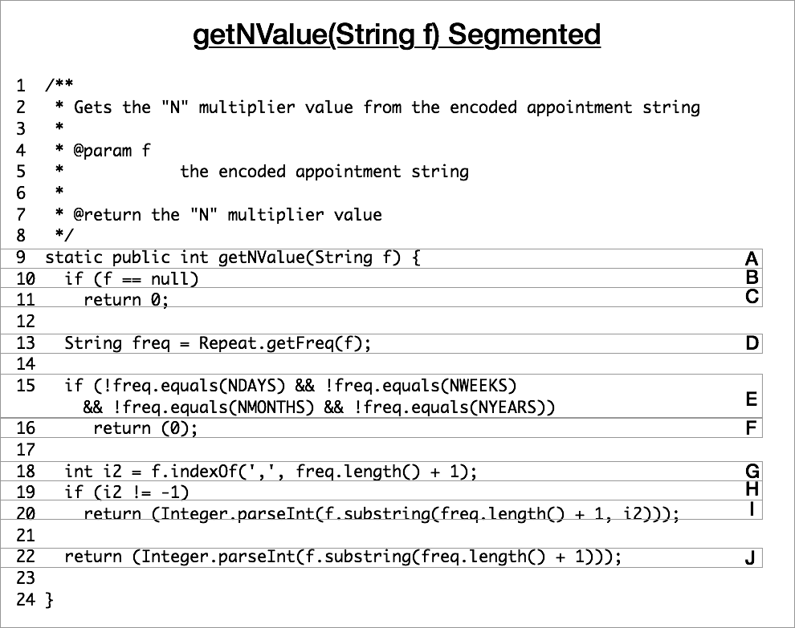
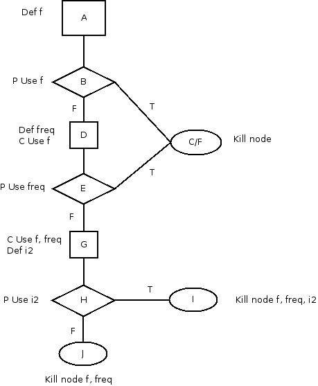

# Data Flow

## Data Flow Diagram

The Data Flow Diagram below shows the segments labelled by the type of node.

## Program Segmented

The same program has been broken up into corresponding segments basked on the
data flow diagram above.

## Program Graph

The following figure shows the program graph for the segmented code segment
above.

## All-Defs

Each definition of each variable for at least one use of the definition: 

## All-Uses

At least one path of each variable to each c-use of the definition

## All-P-Uses / Some-C-Uses

At least one path of each variable definition to each p-use of the variable.
If any variable definitions are not covered by p-use, then use c-use

## All-C-Uses / Some-P-Uses

At least one path of each variable definition to each c-use of the variable.
If any variable definitions are not covered, use p-use

\newpage
