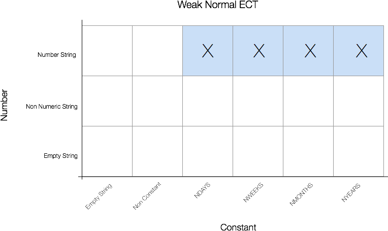
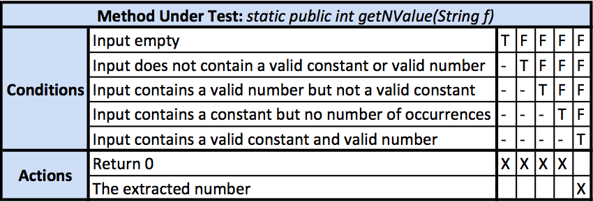

# Method Test #3:

The method under test has the following signature, including java doc:

```java
/**
 * Gets the "N" multiplier value from the encoded appointment string
 *
 * @param f
 *            the encoded appointment string
 *
 * @return the "N" multiplier value
 */
static public int getNValue(String f);
```

Using the testing techniques which we have discussed in class we have devised the following testing strategy for testing the above stubbed method. Upon inspection, the method under test takes as an argument a `String`. This was troublesome but looking further into this we were able to deduce what, in this case, a valid `String` is. In this context a valid input string is one which contains some word, *Constant*, and a comma separated integer, *Number* such that it has the form `"Constant,Number"`. In the context of testing we can break this up into essentially *2* inputs, the Constant and the Number. This is important to note from the start as we use this context through the entire test.

## Boundary Value Testing

As the input is a `String` and the output is an `int`, we can carefully consider the edge cases where the input is Constant + Number (See Appendix A for the JUnit test cases for this method):

**Constant**:  
  - The empty `String`.  
  - A very long `String`.  
  - A desirable `String`.  
  - Without a comma separator.  

**Number**:  
  - The empty `String`.  
  - A non-numeric `String`.  
  - A very large negative `int` and `float`.  
  - Zero.  
  - A very large positive `int` and `float`.  


## Equivalence Class Testing

Using the following strategy we attempt to cover some of the missing gaps, and remove some of the redundancy from the *Boundary Value Tests*. The following diagrams present this testing strategy, each of the possible Number inputs are on the Y axis, while each of the possible Constant inputs are on the X axis. Each of the filled in boxes presents valid input, while the X represents a corresponding test case. See Appendix A for the JUnit test cases for this method.

  

  

  


\newpage

## Decision Table Testing

In the following decision table we show the desired behaviour of the system; under the condition what the desired action should be. See Appendix A for the JUnit test cases for this method.



# Appendix A  

Using the outlined testing strategies we have developed the following test cases for the method under test:

## Boundary Value Tests

```java
/**
 * Test Case to represent the Boundary Value Tests.
 */
@Test
public void testGetNValueBVT() {

  /*
   * Constant: 1. The empty String. 2. A very long String. 3. A desirable
   * String. 4. Without a comma separator.
   */

  // 1. The empty String.
  assertEquals(Repeat.getNValue(""), 0);

  // 2. A very long String.
  assertEquals(Repeat.getNValue("THISORANGEJUICETASTESLIKECOFFEE"), 0);

  // 3. A desirable String.
  assertEquals(Repeat.getNValue("nweeks"), 0);

  // 4. Without a comma separator.
  assertEquals(Repeat.getNValue("nweeks 5"), 5);

  /*
   * Number: 1. The empty String. 2. A non-numeric String. 3. A very large
   * negative int and float. 4. Zero. 5. A very large positive int and
   * float.
   */

  // 1. The empty String.
  assertEquals(Repeat.getNValue("nweeks, "), 0);

  // 2. A non-numeric String.
  assertEquals(Repeat.getNValue("nweeks,SEVEN"), 0);

  // 3. A very large negative int and float.
  assertEquals(Repeat.getNValue("nweeks," + Integer.MIN_VALUE), 0);
  assertEquals(Repeat.getNValue("nweeks," + Float.MIN_VALUE), 0);

  // 4. Zero.
  assertEquals(Repeat.getNValue("nweeks,0"), 0);

  // 5. A very large positive int and float.
  assertEquals(Repeat.getNValue("nweeks," + Integer.MAX_VALUE), 0);
  assertEquals(Repeat.getNValue("nweeks," + Float.MAX_VALUE), 0);
}
```
## Equivalence Class Tests

```java
/**
 * Test case to represent the Equivalence Class Tests.
 */
@Test
public void testGetNValueECT() {
  /*
   * 1. Weak Normal Test Cases. 2. Strong Normal Test Cases. 3. Weak
   * Robust Test Cases. 4. Strong Robust Test Cases.
   */

  String number = "";
  String constant = "";

  /*
   * Weak Normal Test Cases A. NDAYS, Numeric String B. NWEEKS, Numeric
   * String C. NMONTHS, Numeric String D. NYEARS, Numeric String
   */
  // A. NDAYS, Numeric String
  number = "5";
  constant = Repeat.NDAYS;
  assertEquals(Repeat.getNValue(constant + "," + number), 5);

  // B. NWEEKS, Numeric String
  number = "5";
  constant = Repeat.NWEEKS;
  assertEquals(Repeat.getNValue(constant + "," + number), 5);

  // C. NMONTHS, Numeric String
  number = "5";
  constant = Repeat.NMONTHS;
  assertEquals(Repeat.getNValue(constant + "," + number), 5);

  // D. NYEARS, Numeric String
  number = "5";
  constant = Repeat.NYEARS;
  assertEquals(Repeat.getNValue(constant + "," + number), 5);

  /*
   * 2. Strong Normal Test Cases :: Same as Weak Normal due to input range.
   */

  /*
   * 3. Weak Robust Test Cases
   *
   * A. Empty String, Empty String.
   * B. Non Constant, Non Numeric.
   * C. NDAYS, Numeric String. (COVERED IN 1 and 2)
   * D. NDAYS, Empty String.
   * E. NWEEKS, Non Numeric.
   * F. NMONTHS, Numeric String. (COVERED IN 1 and 2)
   * G. NMONTHS, Empty String.
   * H. NYEARS, Non Numeric String.
   */

   // A. Empty String, Empty String.
    number = "5";
    constant = Repeat.NYEARS;
    assertEquals(Repeat.getNValue(constant + "," + number), 0);

   // B. Non Constant, Non Numeric.
    number = "notanumber";
    constant = "notconstant";
    assertEquals(Repeat.getNValue(constant + "," + number), 0);

   // D. NDAYS, Empty String.
    number = "";
    constant = Repeat.NDAYS;
    assertEquals(Repeat.getNValue(constant + "," + number), 0);

   // E. NWEEKS, Non Numeric.
    number = "notanumber";
    constant = Repeat.NWEEKS;
    assertEquals(Repeat.getNValue(constant + "," + number), 0);


   // G. NMONTHS, Empty String.
    number = "";
    constant = Repeat.NMONTHS;
    assertEquals(Repeat.getNValue(constant + "," + number), 0);

   // H. NYEARS, Non Numeric String.
    number = "notanumber";
    constant = Repeat.NYEARS;
    assertEquals(Repeat.getNValue(constant + "," + number), 0);


  /*
   * 4. Strong Robust Test Cases
   *
   * A. Constant Empty String, Empty String. (COVERED IN 3[A])
   * B. Constant Empty String, Non Numeric.
   * C. Constant Empty String, Numeric.
   * D. Non Constant, Number Empty String.
   * E. Non Constant, Non Numeric. (COVERED IN 3[B])
   * F. Non Constant, Numeric.
   * G. NDAYS, Empty String. (COVERED IN 3[D])
   * H. NDAYS, Non Numeric String.
   * I. NDAYS, Numeric String. (COVERED IN 1)
   * J. NWEEKS, Empty Number String.
   * K. NWEEKS, Non Numeric. (COVERED IN 3[E])
   * L. NWEEKS, Numeric. (COVERED IN 1[B])
   * M. NMONTHS, Empty Number String. (COVERED IN 3[G])
   * N. NMONTHS, Non Numeric String.
   * O. NMONTHS, Numeric String. (COVERED IN 1[C])
   * P. NYEARS, Empty Number String.
   * Q. NYEARS, Non Numeric String. (COVERED IN 3[H])
   * R. NYEARS, Numeric String (COVERED IN 1[D])
   */


  // B. Constant Empty String, Non Numeric.
    number = "notanumber";
    constant = "";
    assertEquals(Repeat.getNValue(constant + "," + number), 0);

  // C. Constant Empty String, Numeric.
    number = "5";
    constant = "";
    assertEquals(Repeat.getNValue(constant + "," + number), 0);

  // D. Non Constant, Number Empty String.
    number = "";
    constant = "notaconstant";
    assertEquals(Repeat.getNValue(constant + "," + number), 0);

  // F. Non Constant, Numeric.
    number = "5";
    constant = "notaconstant";
    assertEquals(Repeat.getNValue(constant + "," + number), 0);

  // H. NDAYS, Non Numeric String.
    number = "notanumber";
    constant = Repeat.NDAYS;
    assertEquals(Repeat.getNValue(constant + "," + number), 0);

  // J. NWEEKS, Empty Number String.
    number = "";
    constant = Repeat.NWEEKS;
    assertEquals(Repeat.getNValue(constant + "," + number), 0);

  // N. NMONTHS, Non Numeric String.
    number = "notanumber";
    constant = Repeat.NMONTHS;
    assertEquals(Repeat.getNValue(constant + "," + number), 0);

  // P. NYEARS, Empty Number String.
    number = "";
    constant = Repeat.NYEARS;
    assertEquals(Repeat.getNValue(constant + "," + number), 0);

}
```

## Decision Table Tests
```java
/**
 * Test case to represent the Decision Table Tests.
 */
@Test
public void testGetNValueDT() {
  fail("Not yet implemented");
  /*
   * Conditions:
   * C1. Input empty.
   * C2. Input does not contain a valid constant or valid number.
   * C3. Input contains a valid number but not a valid constant.
   * C4. Input contains a constant but no number of occurrences.
   * C5. Input contains a valid constant and valid number.
   *
   * Actions:
   * A1. Return 0
   * A2. The extracted number
   *
   * C1 -> A1.
   * C2 -> A1.
   * C3 -> A1.
   * C4 -> A1.
   * C5 -> A2.
   */

   // C1 -> A1.
    assertEquals(Repeat.getNValue(""), 0);

   // C2 -> A1.
    assertEquals(Repeat.getNValue("notavalidconstant" + "," + "notavalidnumber"), 0);

   // C3 -> A1.
    assertEquals(Repeat.getNValue("notavalidconstant" + "," + "5"), 0);

   // C4 -> A1.
    assertEquals(Repeat.getNValue(Repeat.NDAYS + "," + "notavalidnumber"), 0);
    assertEquals(Repeat.getNValue(Repeat.NDAYS + "," + "-1"), 0);
    assertEquals(Repeat.getNValue(Repeat.NDAYS + "," + "2.5"), 0);
    assertEquals(Repeat.getNValue(Repeat.NDAYS + "," + "0"), 0);

   // C5 -> A2.
    assertEquals(Repeat.getNValue(Repeat.NDAYS + "," + "5"), 5);
    assertEquals(Repeat.getNValue(Repeat.NWEEKS + "," + "5"), 5);
    assertEquals(Repeat.getNValue(Repeat.NMONTHS + "," + "5"), 5);
    assertEquals(Repeat.getNValue(Repeat.NYEARS + "," + "5"), 5);
}
```
