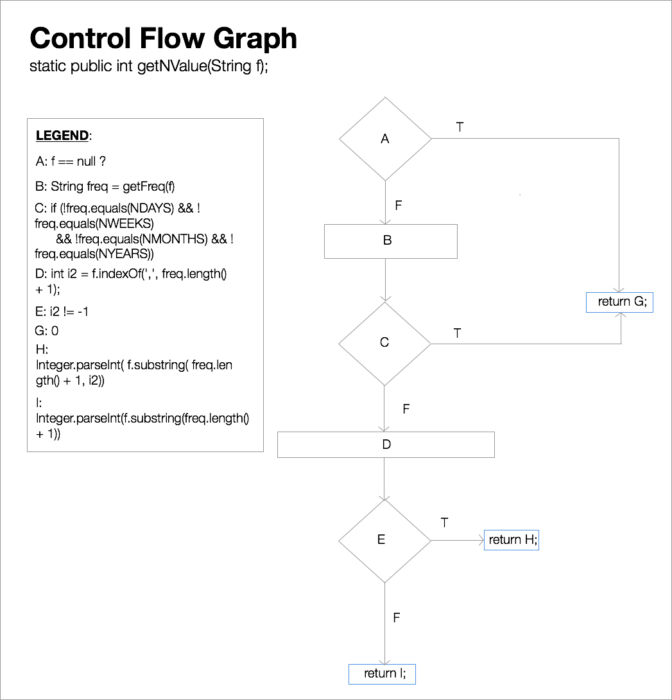

# 4. Control Flow Graph

The control flow graph below is for the `static public getNValue(String f);` method in the `net.sf.borg.model.Repeat` class. The legend provides which steps are executed at each step. For the full method specification, refer to method 3 in Appendix A.

\newpage
